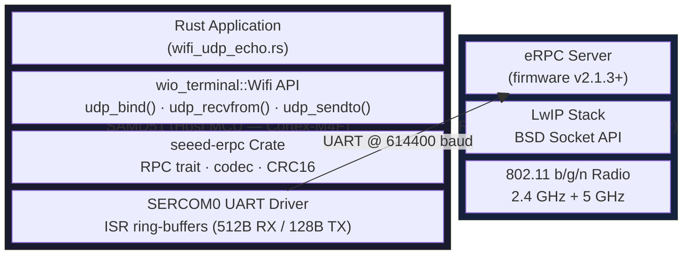
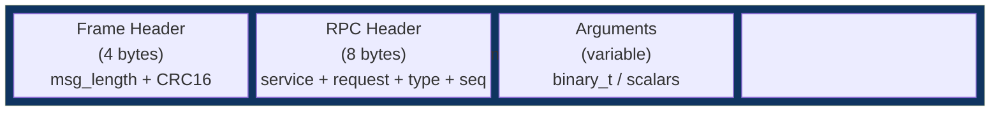
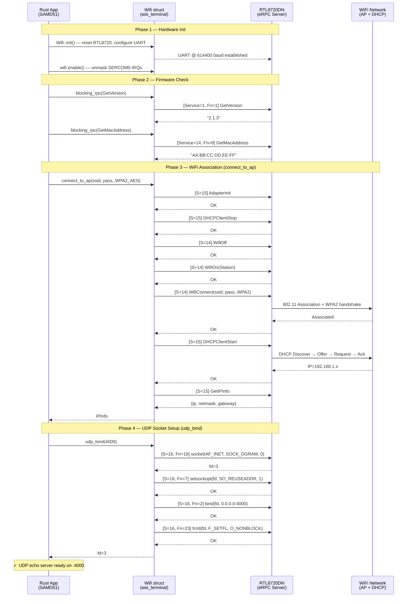
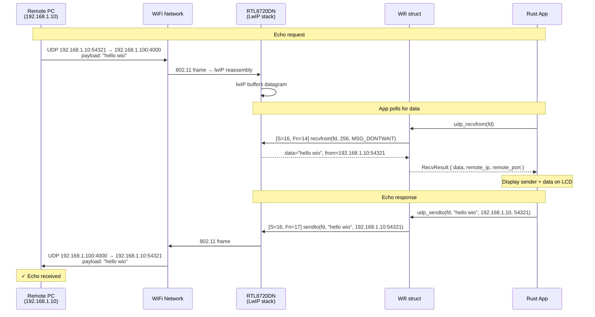

# WiFi UDP Architecture — Wio Terminal (Rust)

This document describes the architecture of the WiFi UDP communication
stack on the Wio Terminal, focusing on how the Rust application on the
SAMD51 host MCU communicates with the RTL8720DN WiFi co-processor to
send and receive UDP datagrams.

## System Block Diagram

The Wio Terminal has a **dual-MCU architecture**: the main application
runs on an Atmel SAMD51 (ARM Cortex-M4F), while WiFi is handled by a
Realtek RTL8720DN co-processor connected via a UART-based eRPC link.



### Data Flow Summary

| Direction | Path |
|-----------|------|
| **TX (send)** | App → `Wifi::udp_sendto()` → `LwipSendto` RPC → eRPC frame → UART TX → RTL8720 eRPC server → lwIP `sendto()` → WiFi radio → air |
| **RX (receive)** | Air → WiFi radio → lwIP buffer → RTL8720 eRPC server → UART RX → eRPC frame decode → `LwipRecvfrom` RPC → `Wifi::udp_recvfrom()` → App |

---

## eRPC Protocol Layer

All communication between SAMD51 and RTL8720DN uses the **eRPC
(Embedded RPC) protocol** over UART:



| Field | Size | Description |
|-------|------|-------------|
| Frame Header | 4 B | `u16 msg_length` + `u16 CRC16` of the payload |
| RPC Header | 8 B | Codec version (1), Service ID, Request ID, MsgType, Sequence |
| Arguments | variable | RPC-specific, little-endian encoded |

### eRPC Services Used

| Service | ID | Purpose |
|---------|----|---------|
| System | 1 | `GetVersion` — firmware version query |
| Wifi | 14 | `WifiOn`, `WifiConnect`, `ScanStart`, `GetMacAddress`, … |
| TCPIP | 15 | `AdapterInit`, `DHCPClientStart/Stop`, `GetIPInfo` |
| **LwIP** | **16** | **BSD socket API: `socket`, `bind`, `sendto`, `recvfrom`, `close`, `fcntl`, `setsockopt`** |

---

## Sequence Diagram: Startup & Socket Setup

This diagram shows the full initialization sequence from power-on to
the UDP echo server being ready to receive packets.



---

## Sequence Diagram: UDP Echo Round-Trip

This diagram shows a single UDP echo exchange — a remote PC sends a
datagram to the Wio Terminal and receives the same data back.



---

## Software Layer Map

```
┌─────────────────────────────────────────────────────────────┐
│                    wifi_udp_echo.rs                          │  Application
│         configure, connect, bind, poll loop                  │
├─────────────────────────────────────────────────────────────┤
│              wio_terminal::Wifi                              │  Board Support
│    connect_to_ap()  udp_bind()  udp_recvfrom()              │
│    udp_sendto()     udp_close()  blocking_rpc()             │
├─────────────────────────────────────────────────────────────┤
│              seeed-erpc (v0.2.0)                             │  eRPC Codec
│    RPC trait  ·  codec::Header  ·  FrameHeader              │
│    ────────────────────────────────────────────              │
│    wifi_rpcs:   GetVersion, WifiConnect, ScanStart, …       │
│    tcpip_rpcs:  AdapterInit, DHCPClientStart, GetIPInfo     │
│    lwip_rpcs:   LwipSocket, LwipBind, LwipRecvfrom,        │
│                 LwipSendto, LwipClose, LwipFcntl, …        │
├─────────────────────────────────────────────────────────────┤
│              SERCOM0 UART (614400 baud)                      │  Transport
│    ISR-driven ring buffers  ·  512B RX  ·  128B TX          │
╞═════════════════════════════════════════════════════════════╡
│              RTL8720DN Firmware (v2.1.3)                      │  Co-processor
│    eRPC server  ·  lwIP  ·  802.11 b/g/n radio             │
└─────────────────────────────────────────────────────────────┘
```

---

## C++ Reference (wio-viessmann-open-therm)

The Rust implementation mirrors the C++ WiFi UDP gateway from the
`wio-viessmann-open-therm` project:

| C++ Component | Rust Equivalent |
|---------------|-----------------|
| `WiFiUDP::begin(port)` | `Wifi::udp_bind(port)` |
| `WiFiUDP::parsePacket()` + `read()` | `Wifi::udp_recvfrom(fd)` |
| `WiFiUDP::beginPacket()` + `write()` + `endPacket()` | `Wifi::udp_sendto(fd, data, ip, port)` |
| `WiFiUDP::stop()` | `Wifi::udp_close(fd)` |
| `WiFi.begin(ssid, pass)` | `Wifi::connect_to_ap(ssid, pass, security)` |

The key difference is that the C++ Arduino library wraps the BSD
socket calls behind a `WiFiUDP` class that manages buffers internally,
while the Rust API exposes individual socket operations directly,
matching the underlying eRPC service 16 (LwIP) calls.
